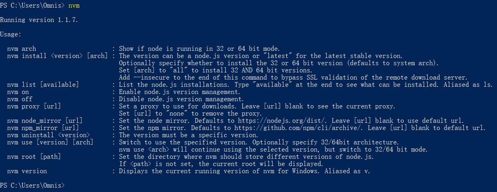
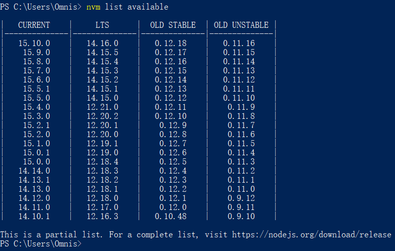
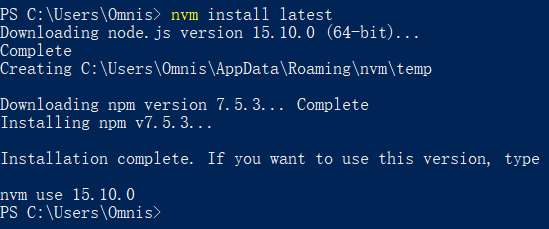

# Windows 下的 Node.js 版本管理工具

[CreateTime]: # (2020.11.19)
[ModifyTime]: # (2021.03.01)

暂时没有 macOS ，也不想装 Linux ，那就只能在 Windows 的机器上面开发前端了。说到前端就逃避不开 Node ，而 Node 又有那么多的版本，怎么切换又是个麻烦事，在 Linux 上还好，但 Windows 就。。。唉

许久之前看过一篇文章：[管理 node 版本，选择 nvm 还是 n？](https://juejin.im/entry/6844903711613927432)说实话，还挺心动 nvm 的，毕竟它是一个独立的软件，不是 npm package，这可惜的是 Windows 上没有。

不过过了这么久，再去搜索，却发现了一个项目 [coreybutler/nvm-windows](https://github.com/coreybutler/nvm-windows) 。感觉也是不错，把 nvm 带到了 Windows 系统上来，而且看版本已经到了 1.1.7 ，要不就试一下吧。

## 安装

在 [Latest release](https://github.com/coreybutler/nvm-windows/releases/latest) 页面下载最新的 `nvm-setup.zip` 文件，解压之后只有一个 nvm-setup.exe 文件，双击运行。

默认安装路径是 `C:\Users\Omnis\AppData\Roaming\nvm` ，好评！

然后创建 symlink ，好评！

全程不拖泥带水的，一下子就好了，好评！

## 使用

随便打开一个终端（PowerShell），输入 `nvm` 回车，就有帮助信息了。这种安装方式感觉好像是 Linux 啊，没有界面，也不需要界面。



留意到帮助信息里面有两条命令，一个是 `node_mirror` ，另一个是 `npm_mirror` 。这东西一看就知道是干嘛的了，不废话，拿淘宝的源怼上。

```
nvm node_mirror http://npm.taobao.org/mirrors/node/
nvm npm_mirror https://npm.taobao.org/mirrors/npm/
```

换源就已经好了，接下来安装一个 node 吧，还有 npm 。

用 `npm list available` 看看有啥版本。



选最新的进行安装吧：`nvm install latest` 。 



**方便~ 舒服~ 完事了~**

哦对了，别忘了运行一下 `nvm use 15.10.0` 来启用 node 。
